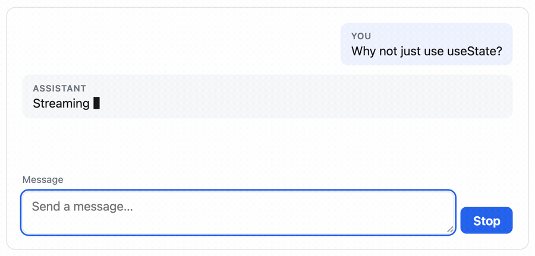

# ai-chat-kit

Headless React hooks and components for streaming LLM chat UIs, built around one
decision: **the streaming state lives outside React**, so a token re-renders one
message instead of the whole transcript.

[](https://github.com/mykolapodpriatov/ai-chat-kit/actions/workflows/ci.yml)
[](https://www.npmjs.com/package/@podpriatov/ai-chat-kit)
[](https://mykolapodpriatov.github.io/ai-chat-kit/)
[](LICENSE)



**[Live demo →](https://mykolapodpriatov.github.io/ai-chat-kit/)** — runs on the
mock transport, so it needs no API key and works offline. It also reaches states
a live demo cannot produce on demand: a stream slow enough to interrupt, a 502
after six tokens, a 429 carrying `Retry-After`.

```bash
npm install @podpriatov/ai-chat-kit react
```

> The package is scoped because npm rejects the unscoped `ai-chat-kit` as too
> similar to an existing `aichatkit`. The repository keeps the plain name.

```tsx
import { Chat, createOpenAICompatibleTransport } from '@podpriatov/ai-chat-kit';

// In a real app this points at your own backend route, not the provider —
// see "Where the key goes" below.
const transport = createOpenAICompatibleTransport({
  baseUrl: '/api/llm',
  model: 'gpt-4o-mini',
});

export function Support() {
  return <Chat transport={transport} />;
}
```

## Why this project exists

Streaming a reply into a React chat is easy to get working and easy to get
structurally wrong. The obvious implementation holds the transcript in
`useState` and appends each token to it. It is correct, it is what the docs
suggest, and every token invalidates the state that owns the whole list — so
React re-renders every row.

The cost is `deltas × messages`. The chat feels fine for ten minutes and janky
after an hour, which is the hardest kind of performance bug to attribute.

This library moves the conversation into a store that components subscribe to
**per message**. Same tokens, same UI, different cost curve.

## Architecture

```
                    ┌──────────────────────────────┐
                    │  ChatTransport               │
                    │  openai-compatible │ mock    │
                    └──────────────┬───────────────┘
                                   │ ReadableStream<StreamEvent>
                                   ▼
   ReadableStream ──▶ SSE parser ──▶ ChatStore ──▶ useSyncExternalStore
                                        │
                     ┌──────────────────┼──────────────────┐
                     ▼                  ▼                  ▼
              MessageBubble       MessageBubble       MessageBubble
              (subscribed)        (subscribed)        (subscribed ← streaming)
```

`MessageList` renders **ids**, not content. Each row fetches its own message
from the store, so a delta wakes exactly one row and the list itself only
re-renders when a message is added or removed.

Layers, and what each is forbidden from knowing:

| Layer            | Knows about                  | Must not know about    |
| ---------------- | ---------------------------- | ---------------------- |
| `src/core`       | parsing, state, retry policy | React, HTTP, providers |
| `src/transport`  | one provider's wire format   | React, the store       |
| `src/hooks`      | the store, React             | providers, HTTP        |
| `src/components` | the hooks                    | everything below them  |

ESLint enforces the React-free layers. A boundary nobody enforces erodes on the
first busy afternoon.

## Key engineering decisions

### Why streaming state lives outside React

```
ReadableStream → chunk parser → ChatStore → useSyncExternalStore → subscribed rows
```

Two invariants make it work, and both are covered by tests because both fail
silently rather than loudly:

1. **`getSnapshot()` returns the same object until something changes.**
   `useSyncExternalStore` compares by reference; a fresh object per call is an
   infinite render loop that appears only at runtime.
2. **A mutation replaces only the objects on the path it touched.** The guard
   test asserts a message's snapshot is _referentially identical_ after 100
   deltas land on a different message.

Full reasoning: [ADR 001](docs/decisions/001-streaming-state-outside-react.md).

### The core knows nothing about providers

One interface — `send(request, { signal }) → ReadableStream<StreamEvent>` — and
nothing else crosses the boundary. Sending prompts through your own backend
route is a transport, not a fork. [ADR 002](docs/decisions/002-transport-abstraction.md).

### Stop belongs to the user, not to the transport

`stop()` settles the store from the abort event directly rather than waiting for
the transport to notice its signal. A third-party adapter that ignores
`AbortSignal` would otherwise leave the caret blinking forever. Unmounting
mid-stream aborts too — without it the request runs to completion in the
background, billing for tokens nobody will see.

### Retry replays only what could succeed

Never an abort, never a 4xx, never a parse failure — identical bytes produce an
identical parse failure and cost the user money. A 429 carrying `Retry-After` is
**obeyed** rather than overridden by our backoff; answering "wait 30 seconds"
with a 100 ms retry is how an account gets limited harder.

## Performance

Measured with each delta on its own flush — the way streaming actually arrives.
Batching deltas inside a single `act()` lets React coalesce them into one render
pass, which reports roughly a tenth of the real cost and flatters the naive
implementation most, since batching is exactly what hides its problem.

| Messages | Deltas | Row renders (naive) | Row renders (this) | Ratio |    Naive |  This |
| -------: | -----: | ------------------: | -----------------: | ----: | -------: | ----: |
|       10 |    200 |               2,000 |                200 |   10× |    94 ms | 15 ms |
|      100 |    200 |              20,000 |                200 |  100× |   194 ms | 17 ms |
|    1,000 |    200 |             200,000 |                200 | 1000× | 1,400 ms | 75 ms |
|      100 |  1,000 |             100,000 |              1,000 |  100× |   612 ms | 47 ms |

Reproduce with `pnpm bench`. Render counts are asserted in CI; the milliseconds
are from one machine and are indicative only — a shared runner's timings are
noise, and asserting on them produces a flaky test people learn to rerun.

The shape is the point: naive cost is `deltas × messages`, this is `deltas`.

## Testing

125 tests across three layers. `pnpm test`.

| Layer         | Covers                                                                         |
| ------------- | ------------------------------------------------------------------------------ |
| Core (node)   | SSE parsing, the store's snapshot contract, retry policy, error classification |
| React (jsdom) | hooks, components, and the render-isolation proof                              |
| Package       | the real tarball, installed and imported four ways                             |

Three things the tests exist to catch, because each is invisible until it is
expensive:

- **A multi-byte character split across chunk boundaries.** Decoded per chunk it
  becomes `U+FFFD`; there is a test that cuts a UTF-8 sequence in half.
- **A final SSE event with no trailing blank line.** Dropping it silently
  truncates the last token.
- **Whole-list re-rendering creeping back.** The benchmark asserts render
  counts, so a regression fails CI rather than reaching a user with a long
  conversation.

`pnpm verify:package` installs the built tarball into a scratch project and
imports it as ESM, as CJS, through the `headless` subpath, and compiles a
TypeScript probe against it under `strict`. That check found a real defect on
its first run: props typed as `React.ReactNode` without importing the type,
which emitted declarations referencing a global namespace the consumer may not
have.

## Accessibility

- The transcript is a **polite** live region. Streaming produces hundreds of
  mutations a second and an assertive region makes a screen reader interrupt
  itself continuously.
- The streaming caret is `aria-hidden` — it is a cursor, not content.
- Enter sends, Shift+Enter inserts a newline, and `isComposing` guards IME
  input so choosing a Japanese candidate with Enter does not send a
  half-composed message.
- While streaming the button becomes **Stop**, not a disabled Send.
- Focus stays in the composer after sending.
- `axe-core` runs over the components in the test suite and fails the build on
  serious or critical violations — the empty, mid-conversation, mid-stream and
  error states are all covered.

## Usage

### Headless: bring your own UI

```tsx
import {
  useChatStream,
  createMockTransport,
} from '@podpriatov/ai-chat-kit/headless';

const transport = createMockTransport({ script: 'Hello there.' });

function Chat() {
  const { messages, isStreaming, send, stop, error } = useChatStream({
    transport,
    initialMessages: [{ role: 'system', content: 'Be concise.' }],
  });
  // …render however you like
}
```

`@podpriatov/ai-chat-kit/headless` carries the core, the transports and the hooks — the
components are only in the main entry.

### Per-message subscription

This is the hook that makes the numbers above true. A row using it re-renders
when _its_ message changes and at no other time:

```tsx
function Row({ store, id }) {
  const message = useChatMessage(store, id);
  return <li>{message?.content}</li>;
}
```

### Where the key goes

Point the transport at **your own route** and keep the provider key on the
server:

```ts
const transport = createOpenAICompatibleTransport({
  baseUrl: '/api/llm', // your backend proxies to the provider
  model: 'gpt-4o-mini',
});
```

Passing `apiKey` straight to a provider is supported because it is the right
thing for a local model or a trusted-network tool — but a key in the browser is
a key in every browser.

### Errors

```ts
import { RateLimitError, isRetryable } from '@podpriatov/ai-chat-kit/headless';

if (error instanceof RateLimitError) {
  // error.retryAfterMs — what the provider actually asked for
}
```

Every error also carries a `kind` discriminant (`'network' | 'rate-limit' |
'abort' | 'parse'`) so you can `switch` without `instanceof`, which breaks when
a duplicate copy of the package ends up in the dependency tree.

## Running locally

```bash
pnpm install
pnpm test            # 125 tests
pnpm bench           # the performance table above
pnpm storybook       # the demo at localhost:6006
pnpm build           # ESM + CJS + declarations
pnpm verify:package  # install the tarball and import it for real
```

## Architecture decisions

- [ADR 001 — Streaming state lives outside React](docs/decisions/001-streaming-state-outside-react.md)
- [ADR 002 — The core knows nothing about providers](docs/decisions/002-transport-abstraction.md)
- [ADR 003 — What v1 deliberately does not do](docs/decisions/003-v1-boundaries.md)

## Roadmap

Tracked as [open issues](https://github.com/mykolapodpriatov/ai-chat-kit/issues).
Deferred from v1 on purpose, with reasons in
[ADR 003](docs/decisions/003-v1-boundaries.md):

- tool-call rendering
- an Anthropic-native adapter
- message virtualisation
- streaming markdown with syntax highlighting

## License

MIT — see [LICENSE](LICENSE).
